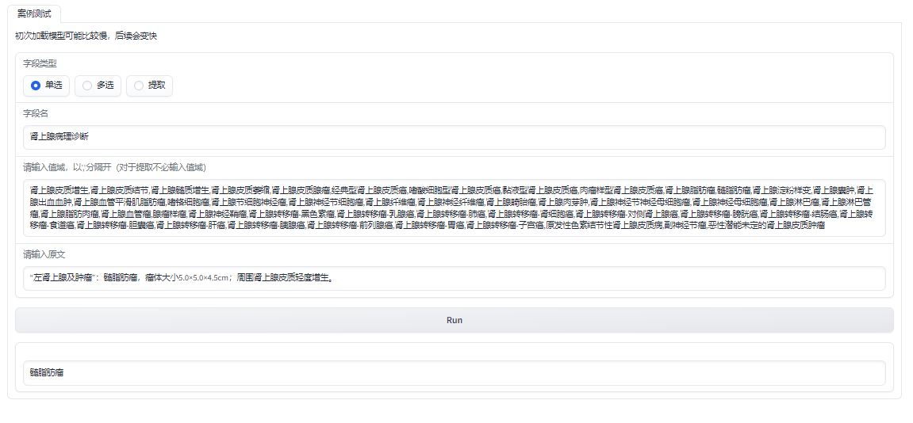
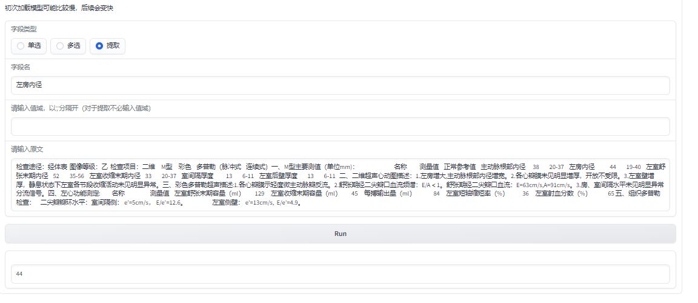
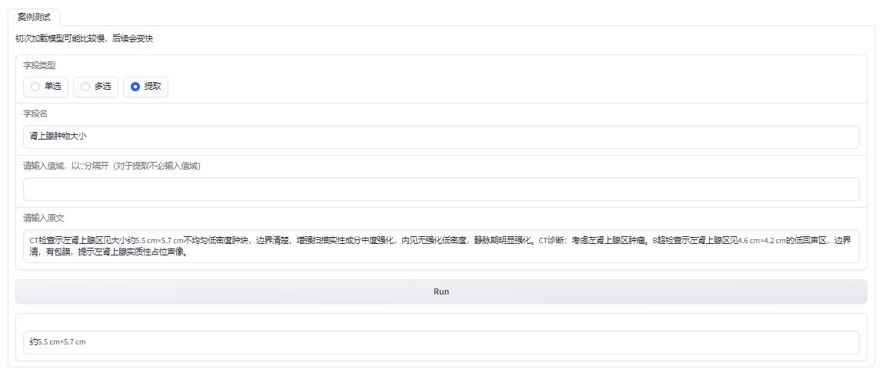

[[中文版](https://github.com/JuneYaooo/llm_structure_tool/blob/main/README.md)] [[English](https://github.com/JuneYaooo/llm_structure_tool/blob/main/README_en.md)]

# 大模型结构化工具

该工具是一个可基于常见开源模型进行微调的结构化工具，旨在帮助用户处理和分析文本数据，目前提供了训练，预测，评估一体化的功能。训练预测部分采用了[[llmtuner](https://github.com/hiyouga/LLaMA-Factory)]，作为一个核心包引入。

它提供了以下常见结构化类型，适用于各种场景下的结构化使用，如病例结构化场景。

- **单选**



- **多选**


- **提取**



### 安装

首先，克隆本项目到本地计算机：

```
git clone https://github.com/JuneYaooo/llm_structure_tool.git
```

#### 建议 conda 安装
##### 方法一
```
cd llm_structure_tool
conda env create -f environment.yml
```
##### 方法二
```
conda create -n llm_structure python=3.9
pip install -r requirements.txt
```

激活conda环境：

```
conda activate llm_structure
```

然后运行前端demo：

```
python app.py
```

### 模型配置
在config/config.py中，填入自己想要使用的模型地址

## 使用方法
结构化工具将在终端上提供一个简单的交互界面。您可以根据提示输入相关信息，选择要执行的功能。

### 单句测试

输入一段话，设定规则，进行单选、多选或提取

**示例：**

字段类型：提取

字段名：肾上腺肿物大小

原文：CT检查示左肾上腺区见大小约5.5 cm×5.7 cm不均匀低密度肿块，边界清楚，增强扫描实性成分中度强化，内见无强化低密度，静脉期明显强化。CT诊断：考虑左肾上腺区肿瘤。B超检查示左肾上腺区见4.6 cm×4.2 cm的低回声区，边界清，有包膜，提示左肾上腺实质性占位声像。


输入不相关的字段，如胃部肿物大小，结果为“未提及”


输入相关的字段，如肾上腺肿物大小，结果为“约5.5 cm×5.7 cm”


### 训练
待填充

### 预测
待填充

### 评估
待填充

## 致谢

- [PULSE](https://github.com/openmedlab/PULSE): 本项目使用了PULSE模型（上海人工智能实验室的医疗开源大模型）
- [llmtuner](https://github.com/hiyouga/LLaMA-Factory): 本项目训练预测代码基于llmtuner

## 贡献

如果您对该项目感兴趣，欢迎贡献您的代码和改进建议。您可以通过以下方式参与：

1. 提交问题和建议到本项目的 Issue 页面。
2. Fork 本项目并提交您的改进建议，我们将会审查并合并合适的改动。
