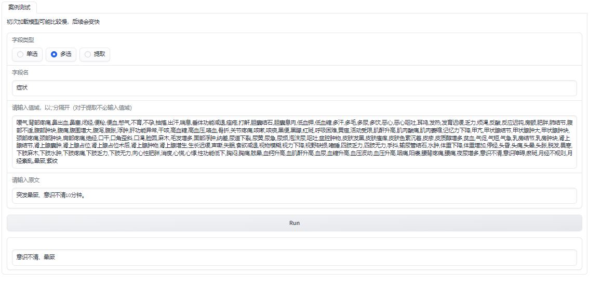

[[中文版](https://github.com/JuneYaooo/llm_structure_tool/blob/main/README.md)] [[English](https://github.com/JuneYaooo/llm_structure_tool/blob/main/README_en.md)]

# Medical Record Structuring Tool (Under Continuous Update)

This tool is a structured tool based on the PULSE model, designed to assist users in processing and analyzing textual data. It provides the following features for structured use in medical scenarios:

- Single selection


- Multiple selection



- Extraction


### Installation

First, clone this project to your local computer:

```
git clone https://github.com/JuneYaooo/llm_structure_tool.git
```

#### Installation using pip

Make sure the following dependencies are installed on your computer:

- Python 3.9
- pip package manager

Navigate to the project directory and install the necessary dependencies:

```
cd llm_structure_tool
pip install -r requirements.txt
```

#### Installation using conda

Make sure the following dependencies are installed on your computer:

- Anaconda or Miniconda

Navigate to the project directory and create a new conda environment:

```
cd llm_structure_tool
conda env create -f environment.yml
```

Activate the newly created environment:

```
conda activate llm_structure
```

Then run the frontend demo:

```
python app.py
```

## Usage

The structuring tool provides a simple interactive interface in the terminal. You can enter relevant information and select the desired functionality based on the prompts.

### Testing

Enter a paragraph, set the rules, and perform single selection, multiple selection, or extraction.

**Example:**

Field Type: 提取

Field Name: 肾上腺肿物大小

Original Text: CT检查示左肾上腺区见大小约5.5 cm×5.7 cm不均匀低密度肿块，边界清楚，增强扫描实性成分中度强化，内见无强化低密度，静脉期明显强化。CT诊断：考虑左肾上腺区肿瘤。B超检查示左肾上腺区见4.6 cm×4.2 cm的低回声区，边界清，有包膜，提示左肾上腺实质性占位声像。

Entering an unrelated field, such as "Gastric Tumor Size," will result in "Not mentioned."


Entering a related field, such as "Adrenal Tumor Size," will result in "Approximately 5.5 cm × 5.7 cm."


## Acknowledgments

- [PULSE](https://github.com/openmedlab/PULSE): The model used in this project is based on PULSE.

## Contribution

If you are interested in this project, you are welcome to contribute your code and improvement suggestions. You can participate in the following ways:

1. Submit issues and suggestions to the Issue page of this project.
2. Fork this project and submit your improvement suggestions. We will review and merge appropriate changes.